* [LINK to GITHUB](https://github.com/cmsc-vcu/cmsc427-sp2025-hw11-AryanCMSC)

* [LINK to FIGMA](https://www.figma.com/design/oL9F1gHWi1erm0s4dxH21n/HW8?node-id=0-1&p=f&t=hA6gxkRpvCFSLnvT-0)

* [LINK to Snack Editor](https://snack.expo.dev/@rathia/hw11-v2)

# Overview of Toybox

Toybox is a comprehensive collection management app designed to streamline the process of tracking, budgeting, and completing collectible sets. Whether you're collecting vintage toys, trading cards, comics, or memorabilia, Toybox helps you organize your collections, track your spending, and find the items you're missing without the hassle of endless manual research.

# Key features

Collection Management:

    - Create, edit, and delete collection sets

    - Mark items as acquired, wanted, or watching

    - Add custom notes, condition ratings, and purchase details

    - Upload photos of your items


    Setlist System:

    - Import published setlists from other users

    - Create and share your own setlists

    - Verify and validate community setlists for accuracy


    Marketplace Integration:

    - Connect with eBay's API to search for missing items

    - Receive notifications for new listings, price drops, and special offers

    - Compare prices across multiple listings

    - Filter by item condition, seller rating, and location


    Budget Tracking:

    - Set overall collection budgets and per-item price limits

    - Track expenses by collection, category, and time period

    - Generate spending reports and projections

    - Receive alerts when approaching budget limits


    Collection Analytics:

    - View completion percentage by set and collection

    - Track market value of your collections over time

    - Generate insights on collecting habits and opportunities

    - Export collection data for backup or sharing

# Individual Screen details

The following section documents the individual screens of the application, the elements on each screen,
and how the user is expected to interact with the screen.

-----

## Main screen

The main screen serves as the central node for this application.  All other screens return to this screen.

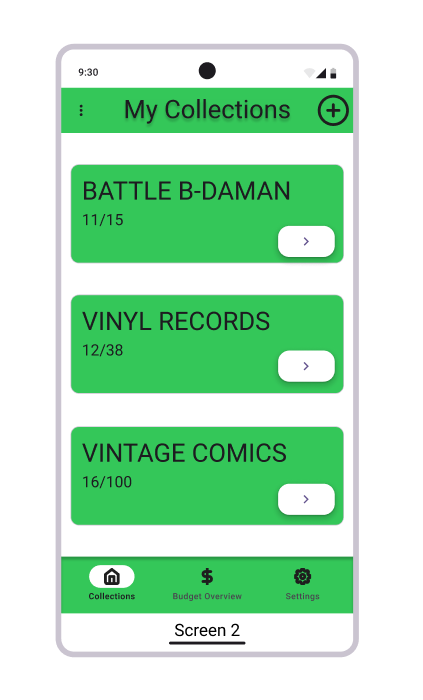{height=400 fig-align="center"}


### wireframe design

Home Screen: Dashboard displaying collection progress, recent acquisitions, and marketplace alerts.

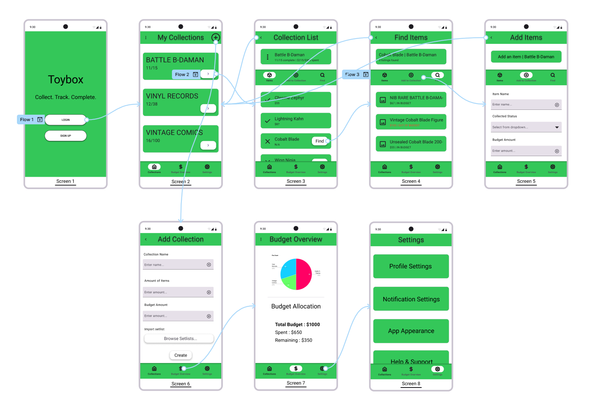{height=400 fig-align="center"}

### As-built screenshot

Here is a screen shot of the image I created running on my phone.

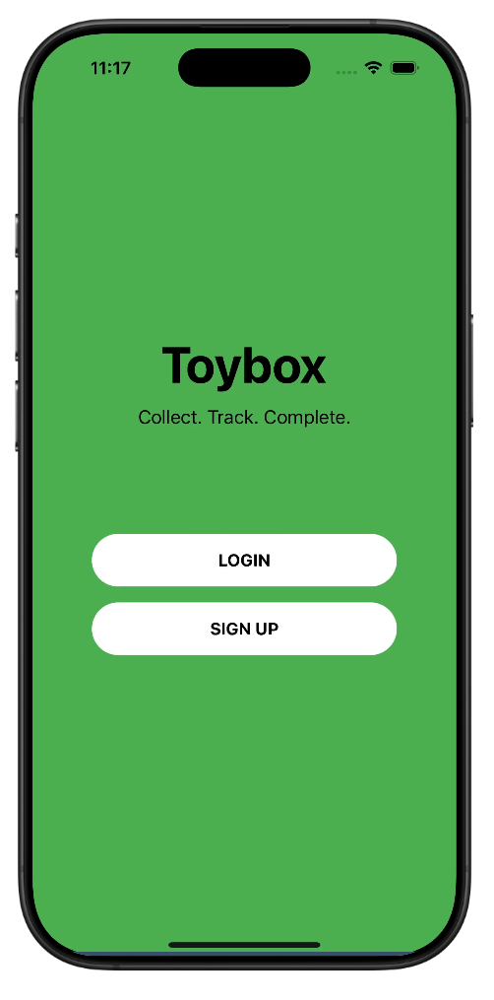{height=400 fig-align="center"}

-----

## Collection list screen

The collection list screen allows you to see all of your items within a selected collection. You can use this screen to edit collections, navigate to other collection tabs, etc.

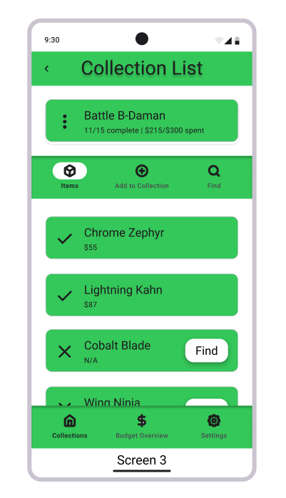{height=400 fig-align="center"}


### wireframe design

Collections View: Organized by category with visual progress indicators.

{height=400 fig-align="center"}

### As-built screenshot

Here is a screen shot of the image I created running on my phone.

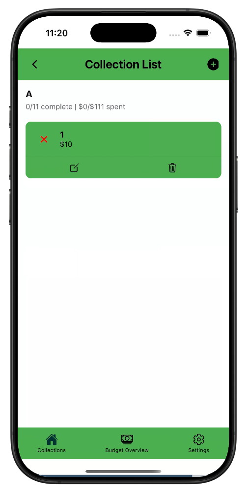{height=400 fig-align="center"}

-----

## Add Items screen

The add items screen allows you to add new items as well as their budget and collected status. You can also edit pre-existing items.

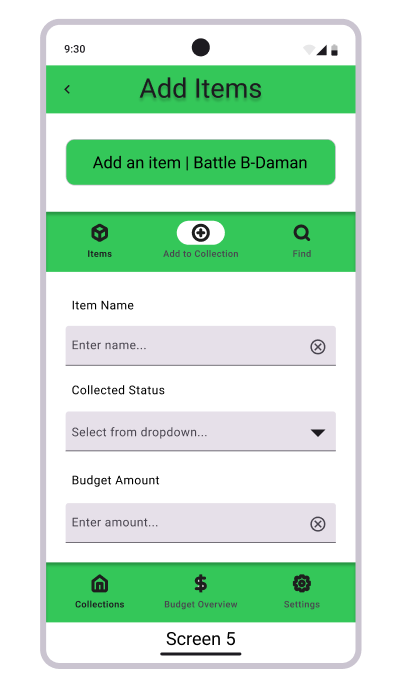{height=400 fig-align="center"}


### wireframe design

Item Adding: Input information about each item including item name, budget amount, and collected status.

{height=400 fig-align="center"}

### As-built screenshot

Here is a screen shot of the image I created running on my phone.

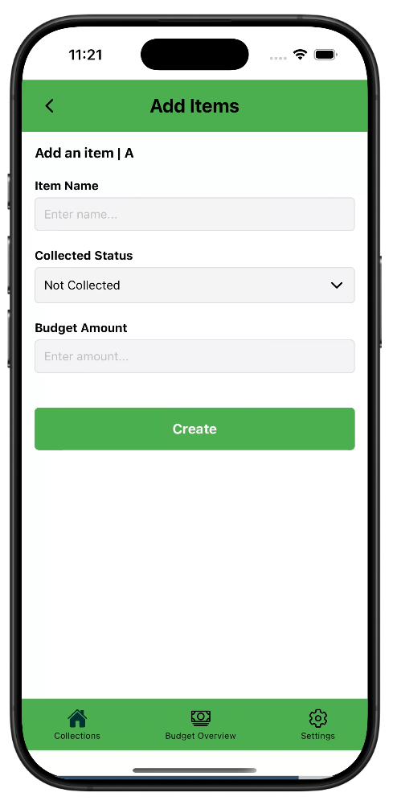{height=400 fig-align="center"}

-----

## Add Collections screen

The add collection screen allows you to create new collections as you wish and import setlists to quickly copy an already created collection within the community.

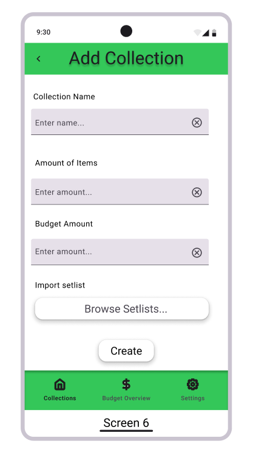{height=400 fig-align="center"}


### wireframe design

Collection Adding: Input information about each collection including collection name, budget amount, and item amount. Setlists can also be imported.

{height=400 fig-align="center"}

### As-built screenshot

Here is a screen shot of the image I created running on my phone.

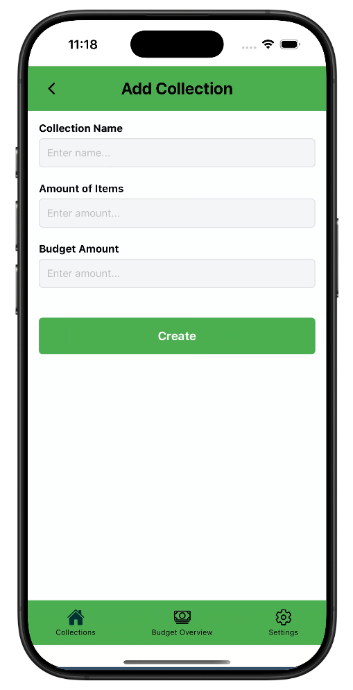{height=400 fig-align="center"}

-----

## Budget Overview screen

The budget overview screen allows you to track your overall budget.

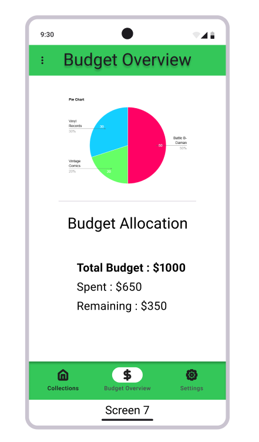{height=400 fig-align="center"}


### wireframe design

Budget Section: Visual graphs and charts showing spending patterns as well as total budget, spent, and remaining amount.

{height=400 fig-align="center"}

### As-built screenshot

Here is a screen shot of the image I created running on my phone.

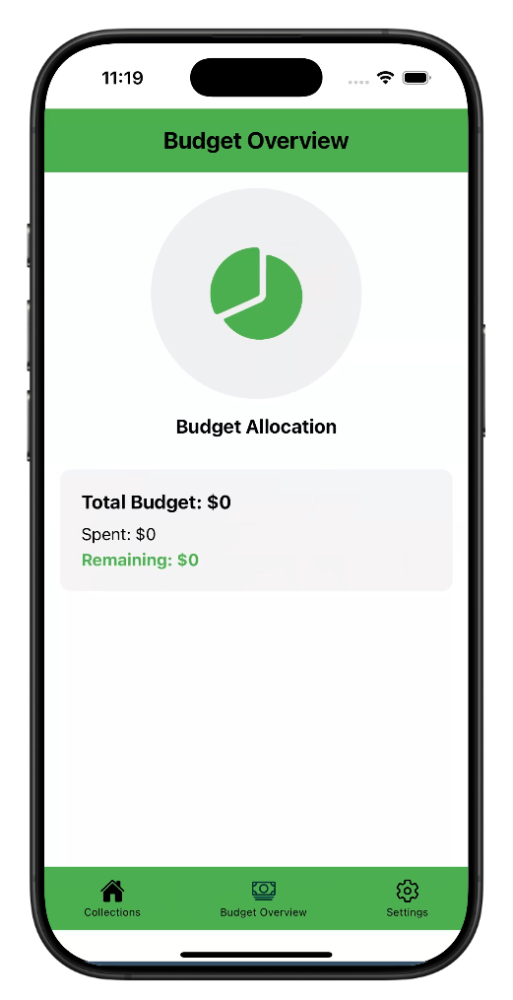{height=400 fig-align="center"}

-----

## Settings screen

The settings screen allows you to modify settings for your profile, notifications, app, and support.

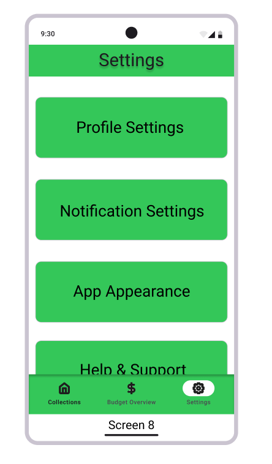{height=400 fig-align="center"}


### wireframe design

Settings page: Changing settings for profile, notifications, app colors, and help and support tips.

{height=400 fig-align="center"}

### As-built screenshot

Here is a screen shot of the image I created running on my phone.

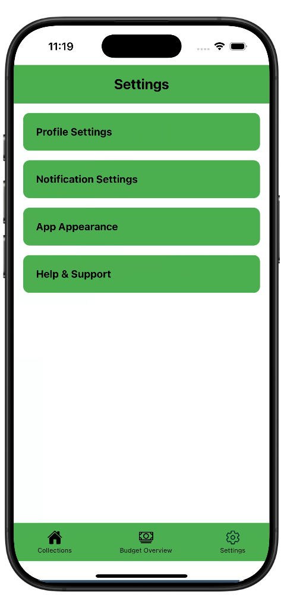{height=400 fig-align="center"}

# Snack code for the application

(this is a level 1 section, provide a snack that contains your currently working app which
includes your screens and a navigation system.
)

```{=html}
<div data-snack-id="@rathia/hw11-v2" data-snack-platform="web" data-snack-preview="true" data-snack-theme="light" style="overflow:hidden;background:#fbfcfd;border:1px solid var(--color-border);border-radius:4px;height:505px;width:100%"></div>
<script async src="https://snack.expo.dev/embed.js"></script>
```


# Reflection

Discuss your experience coding hooks in this assignment.  Which hooks were hardest?  Which easiest?  What helped you figure them out?
: useState was the easiest hook to implement as it's straightforward for managing component state. useContext was more of a pain in the ass because it required setting up the context provider and properly connecting components. useEffect with dependency arrays was the hardest to get JUST right, especially when dealing with navigation and UI updates.

How much time did you spend on this specific assignment (homework 11 - interactivity)?
: Around 10-12 hours, with most of that time spent debugging the item/collection deletion functionality and ensuring state updates properly refreshed the UI.
What was the easiest part of this specific assignment (hw11)?
: Filling out the quarto report since half of it was just copy and pasting and shutting my brain off.

What is the hardest part of this specific assignment (hw11)?
: The deletion functionality was the most challenging part, as it required careful state management to ensure deleted items were properly removed and the UI updated accordingly. I ALSO REALIZED IT WAS JUST BECAUSE OF THE WEB EDITOR AND NOT MY CODE LIKE 3 HOURS INTO IT I WAS GOING TO GO INSANEEEE.

Discuss your overall experience using Snack and developing this mobile app.
: Snack is a convenient platform for React Native development without local setup mumbo jumbo. The real-time preview helped spot UI issues quickly and being able to view your app in all mobile/web views is very interesting to play around with.


# README

A quality README is an important part of EVERY project. Using the Quarto *include* command we're including a copy of your README in the project report so that a human can evaluate it.

Make sure that you edit the README so that it's explanatory!  Note that you don't need a readme within the *reports* folder for this assignment. We're only
focused on the root *README.md*.

[Here is some info](https://www.freecodecamp.org/news/how-to-write-a-good-readme-file/) on how to write a good README!

::: {style="background:lightgray; margin-left:20px; border-top: 3px solid black; border-bottom: 3px solid black; padding-left:20px; padding-right:20px"}

:::
